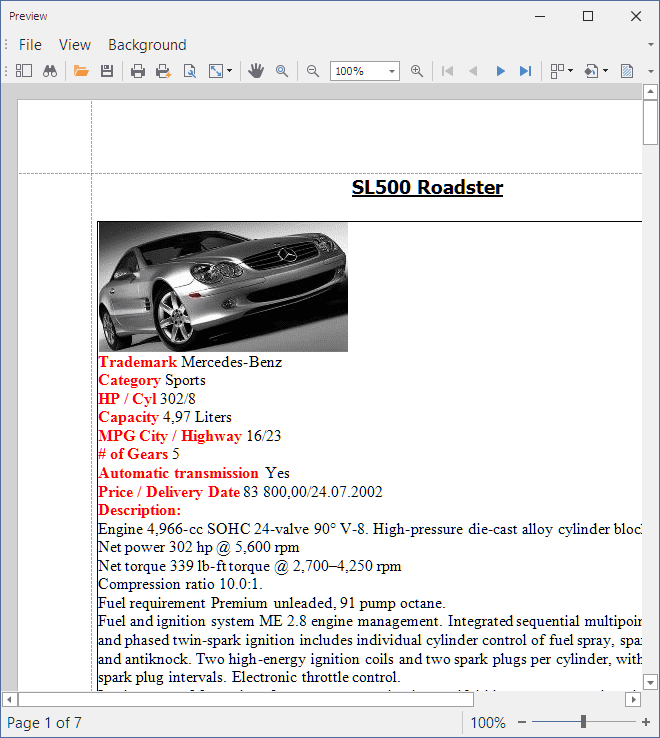
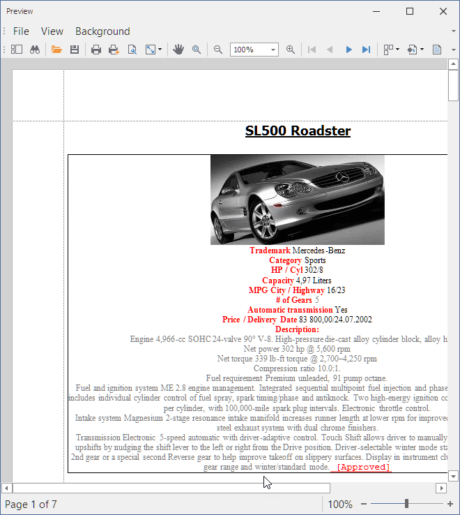

# How to Change Formatting in the XRRichText Control

This example uses the non-visual [RichEditDocumentServer](https://docs.devexpress.com/OfficeFileAPI/DevExpress.XtraRichEdit.RichEditDocumentServer) component to edit and format rich text content of the [XRRichText](https://docs.devexpress.com/XtraReports/DevExpress.XtraReports.UI.XRRichText) control. 

## Original Content
The report preview with the [XRRichText](https://docs.devexpress.com/XtraReports/DevExpress.XtraReports.UI.XRRichText) control that displays the original RTF content is shown below:

## Modified Content

The [RichEditDocumentServer](https://docs.devexpress.com/OfficeFileAPI/DevExpress.XtraRichEdit.RichEditDocumentServer) component applies default formatting, removes whitespaces at the end of the text, appends formatted text, and assigns the resulting RTF text to the [XRRichText.Rtf](https://docs.devexpress.com/XtraReports/DevExpress.XtraReports.UI.XRRichText.Rtf) property. The resulting report is shown in the following image:

## Files to Review

* [Form1.cs](./CS/Form1.cs) (VB: [Form1.vb](./VB/Form1.vb))
* [XtraReport1.cs](./CS/XtraReport1.cs) (VB: [XtraReport1.vb](./VB/XtraReport1.vb))

## Documentation

- [XRRichText Control](https://docs.devexpress.com/XtraReports/DevExpress.XtraReports.UI.XRRichText)
- [RichEditDocumentServer](https://docs.devexpress.com/OfficeFileAPI/DevExpress.XtraRichEdit.RichEditDocumentServer)

## More Examples

- [How to display values of several RTF fields in a single XRRichText control](https://github.com/DevExpress-Examples/Reporting_how-to-display-values-of-several-rtf-fields-in-a-single-xrrichtext-control-e3416)
